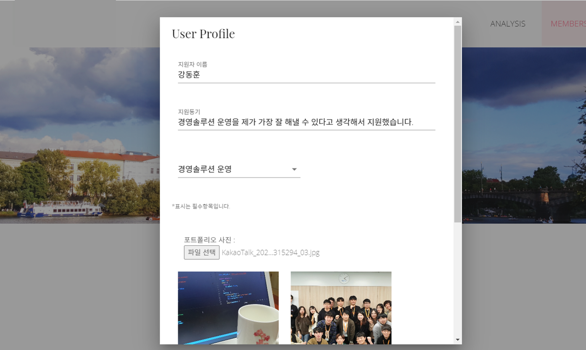

<h1 align="center">AWS Traffic Handling System Architecture Portfolio</h1>
<p>
</p>

<center>
    
</center>

> AWS Huge Traffic Handling System Architecture 1인 개발 토이 프로젝트


## :clapper: [Live Demo Page](http://awstest.jesuisjavert.com)

 (현재는 AWS 요금 문제로 Backend 서버는 꺼두고, Frontend 페이지만 볼 수 있는 상태입니다. 기능 X)

## ✨ Description

```sh
 AWS 상에서의 웹서비스 시스템 아키텍처를 설계하는 과정은 서비스의 확장성 있고,
가용성 높은 운영 여건을 마련하기 위해 필수적입니다.
 본 프로젝트는 이론상으로 설계한 AWS의 여러가지 기능들을 실제로 사용해보고,
대용량 트래픽을 대처하는 고가용성의 시스템 아키텍쳐를 구축하고 실제로 배포해보고,
모니터링툴을 사용해서 시스템이 잘 작동하는지 확인해보기 위함입니다.
 페이지는 테스트 용도로, 동시간대에 많은 유저가 자신의 이력서에 여러장의 사진을 첨부할 때
(or 트래픽이 갑자기 증가할 시) 테스트 페이지가 받는 부하를 견뎌내도록 시나리오로 선정했습니다.
한번의 클릭으로 총 10번 DB에 저장되도록 의도적으로 코드를 작성했으며,
다중으로 업로드한 이미지는 Amazon S3 스토리지에 저장됩니다.
```


## :pushpin: Project Goal

```sh
AWS의 트래픽 분산 및 확장성 서비스 설계 및 구현, 배포 및 모니터링 툴 사용
1. AutoScaling 2.DNS Server Routing (AWS 53) 3.LoadBalancer(ELB) 4.CDN(Cloudfront)
5. Monitoring Tool (AWS CloudWatch) 6. ElastiCache
```


## :pencil2:  AWS System Architecture

<center>
    
</center>

## :wrench: Tech Stack

### 	- Back-end : Django

### 	- Front-end : Vue.js

### 	- Deploy : Nginx, gunicorn


## :mag: Overview

### 1. 메인 화면 페이지

<center>
    
</center>
<br>

### 2. About me

<center>
    
</center>


<br>

### 3. 회원가입 및 로그인 페이지

<center>
    
</center>

<br>

### 4. 아키텍쳐 설계의도와 과정 소개 페이지

<center>
    
</center>
<br>


## 🎬 Project Analysis

### 1. Backend API Server 와 Frontend 디렉터리 구조

<center>
    
    
    
</center>

1. Django Backend 의 Modeling과 Logic을 담당하는 views.py  (다중이미지 업로드 및 기본 이력서 CRUD)

2. Django REST API와 Section & Component 하여 체계적으로 구성한 Vue (Vuetify library) 기반 frontend 입니다. (모바일 반응형). Django 는 Gunicorn을 통해 배포했고, Vue는 Nginx 포트 설정을 통해 배포했습니다. 
3. 8000번 포트로 API 서버에 접근할 수 있도록 했으며, URL은 기본적으로 RESTful 하게 작성하였습니다.

​    

4. 유저가 이력서를 작성하는 페이지 입니다. 한번의 클릭으로 10번의 DB등록이 일어나도록 설정했습니다.

### 2. AWS Route53 호스팅

<center>
    
    
</center>

1. AWS의 Route 53 기능을 이용해 DNS 서버와 EC2 인스턴스를 연결했습니다. 제 아이디의 도메인인 jesuisjavert.com 을 구매했고, 그 DNS 밑에 awstest.jesuisjavert.com 레코드를 연결했습니다. 

### 3. ELB (Elastic Load Balancer)

<center>
    
    
</center>

1. AWS LoadBalancer 설정입니다. 프로세스 하중이 낮은 웹서버로 트래픽을 분산 시켜, 서버 다운를 미연에 방지하고자 하는 방식입니다.  LoadBalancing 알고리즘은 Round-robin 방식을 차용하였습니다.


### 4. Auto Scaling 그룹 생성

<center>
    
    
    
    
    
</center>

​	1. Auto Scaling 그룹 설정입니다. 트래픽이 증가할 것으로 예상되면, WEB서버 or WAS서버를 자동적으로 Scale Out 하여 트래픽을 감당해주는 서비스입니다. 이를 이용하면, 트래픽 급증에 대비하여 큰 인프라를 구비할 필요 없고, 채용 시즌이후 트래픽이 떨어졌을때는 자동으로 Scale이 줄어들어 관리 및 비용의 효율성을 높일 수 있는 기술입니다. <br>

 이를 통해 클라우드 시스템이 가진 확장성과 유연성의 장점을 극대화 할 수 있습니다.  Auto Scaling 조정 정책은 평균 PC 사용률이 80 이상일 경우에 새로운 EC2 서버를 Scale Out 하도록 설정했습니다.


## AWS CloudWatch DashBoard

<center>
    
</center>

​     1.  AWS CloudWatch 기능을 이용해, 트래픽, CPU 사용률 등을 감시하고 분석할 수 있도록 했습니다.<br>

### 총평:

​      대용량 트래픽을 염두에 둔 시스템 아키텍처를 직접 내 손으로 구현해보는 것은 굉장히 흥미로운 작업이었습니다. 실제로 이론적으로 배운 기술들을 구현하기 위해, AWS의 공식 문서를 참조하며 내 스스로도 많은 지식을 얻은 것 같아 뿌듯합니다. 총 개발기간이 3일 밖에 주어지지 않아서, 허겁지겁 개발하느라 아직 추가적으로 미구현되어 있는 부분도 있는데, 나중에 시간적 여유가 된다면 Elastic Cache나 Serverless 방식을 도입한 AWS Lambda도 도입해보고 싶습니다.


### 향후 발전 방향:

<center>
    
</center>

ANOS & AFOS 의 인연으로 만나게 된 네트워크 전문가 Cloudnet@ 팀의 가시다 님에게 피드백을 받았습니다. 추후 RDS Read Replica, Elastic Cache, DynamoDB, 대기열 시스템, Multi Domain 기능을 추가한 아키텍쳐를 구현해볼 예정입니다.


## :runner: Steps to run

### Backend

```bash
$ cd modeling
$ python -m venv venv
$ source venv/Scripts/activate
$ python install -r requirements.txt
$ python manage.py runserver
```

### Frontend

```bash
$ cd frontend
$ npm install
$ npm run serve
```

<br>

## 🤼‍♂️Author

Backend & Frontend & AWS System Architecturing : 🐯**Kang Donghoon**

<hr>


## 📝 License

Copyright © 2020  to Kang Donghoon  <br>

<center>
    
</center>